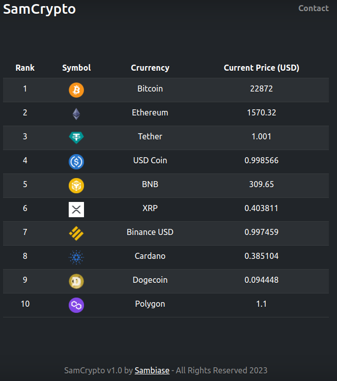

# :zap: Top 10 Crypto Currencies v1.0

  

## :page_facing_up: Table of Contents   

* [:zap: Top 10 Crypto Currencies v1.0](#zap-top-10-crypto-currencies- v1.0)
  * [:page_facing_up: Table of contents](#page_facing_up-table-of-contents)
  * [:books: General info](#books-general-info)
  * [:camera: Screenshots](#camera-screenshots)
  * [:signal_strength: Technologies](#signal_strength-technologies)
  * [:floppy_disk: Setup](#floppy_disk-setup)
  * [:computer: Code Examples](#computer-code-examples)
  * [:clipboard: ToDo](#clipboard-todo)
  * [:file_folder: License](#file_folder-license)
  * [:envelope: Contact](#envelope-contact)

## :books: General info

* Top 10 Crypto Currencies

## :camera: Screenshots

## :signal_strength: Technologies

* [Python v3.10](https://www.python.org/)
* [Django v4.1.5](https://www.djangoproject.com/)
* [Requests v2.28.2](https://pypi.org/project/requests/)
* [Gunicorn v20.1.0](https://gunicorn.org/)
* [Python Decouple v3.7](https://pypi.org/project/python-decouple/)

## :floppy_disk: Setup

* [Install Poetry](https://python-poetry.org/docs/#installation) as Virtual Env
  * create a virtual env with Poetry: `poetry init`
  * access the newly created virtual env: `poetry shell`
* Install Django: `poetry add django`

 

## :computer: Code Examples

* Migrate 
  * `python manage.py makemigrations`
  * `python manage.py migrate`

## :clipboard: ToDo

* ToDo: implement the ability to refresh the values in realtime

## :file_folder: License

* MIT

## :envelope: Contact

* Get in touch with [Sambiase](https://github.com/sambiase)
* E-mail: [marsamb@gmail.com](mailto:marsamb@gmail.com)